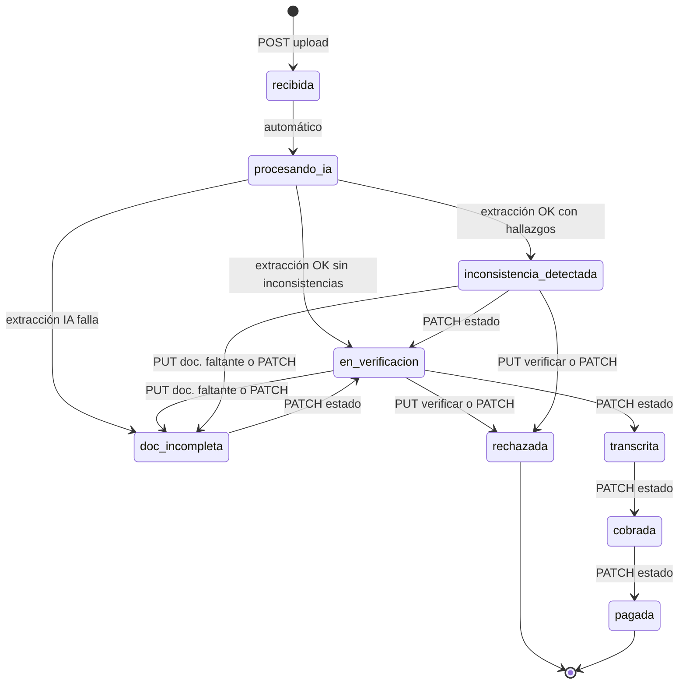

# NomiSalud — Backend API

API REST construida con **FastAPI**, **PostgreSQL** (async con SQLAlchemy) y **Docker**.

---

## Requisitos

- [Docker](https://www.docker.com/) y Docker Compose
- Python 3.12+ (solo para desarrollo local sin Docker)

---

## Levantar el proyecto con Docker

```bash
# 1. Copiar variables de entorno y ajustar valores (incl. GEMINI_API_KEY si quieres extracción IA real)
cp .env.example .env

# 2. Construir y levantar los contenedores
docker compose up --build

# 3. Migraciones + datos de prueba (usuarios y plazos; un solo comando)
docker compose exec api alembic upgrade head
docker compose exec api python -m scripts.seed

# 4. La API estará disponible en:
#    http://localhost:8000
#    Docs Swagger: http://localhost:8000/docs
#    Docs ReDoc:   http://localhost:8000/redoc
```

---

## Endpoints disponibles

| Método | Ruta                           | Auth | Descripción |
|--------|--------------------------------|------|-------------|
| GET    | `/api/v1/health/`              | No   | Estado básico de la API |
| GET    | `/api/v1/health/db`            | No   | Verifica conexión a PostgreSQL |
| POST   | `/api/v1/auth/login`           | No   | Autenticación (retorna JWT) |
| GET    | `/api/v1/incapacidades`        | Sí   | Listado paginado con filtros; incluye `urgencia`, `pago_retrasado` (badge SCRUM-194) y datos de extracción IA |
| GET    | `/api/v1/incapacidades/mias`   | Sí   | Mis trámites (solo `colaborador`): filtro estricto por JWT; cada ítem incluye `estado` y `updated_at` |
| GET    | `/api/v1/incapacidades/{id}`   | Sí   | Detalle del trámite: `extraccion_ia`, lista `inconsistencias` (hallazgos IA) y `archivo_url` |
| GET    | `/api/v1/incapacidades/{id}/archivo` | Sí | Descarga del documento adjunto (mismo JWT que el detalle; ruta validada bajo `UPLOAD_STORAGE_DIR`) |
| PUT    | `/api/v1/incapacidades/{id}/verificar` | Sí | Verificación humana RRHH/admin: `confirmar` o `rechazar` (actualiza extracción, estado e historial) |
| PATCH  | `/api/v1/incapacidades/{id}/estado` | Sí | Cambio de estado con máquina de estados + `historial_estados` (solo RRHH/admin) |
| PUT    | `/api/v1/incapacidades/{id}/documentacion-faltante` | Sí | Registra lista de documentos faltantes y pasa a `doc_incompleta` (RRHH/admin) |
| POST   | `/api/v1/pagos`                | Sí   | Registra un pago, vincula radicados y pasa trámites de `cobrada` → `pagada` (`auxiliar_rrhh`, `coordinador_rrhh`, `admin`) |
| GET    | `/api/v1/pagos`                | Sí   | Lista pagos con filtros (`entidad`, fechas, `estado`) y paginación (mismos roles) |
| GET    | `/api/v1/conciliacion`         | Sí   | Reporte de conciliación por `entidad`, `mes` y `anio` (totales, pendientes, detalle) |
| GET    | `/api/v1/conciliacion/exportar` | Sí  | Descarga XLSX con hojas **Resumen** y **Detalle** (mismos roles que pagos) |
| POST   | `/api/v1/incapacidades/upload` | Sí   | Carga PDF/JPG/PNG, crea trámite y encola extracción IA (Gemini 2.5 Flash) |
| GET    | `/api/v1/admin/plazos-entidad` | Sí   | Listar plazos por entidad y tipo (solo `admin`) |
| GET    | `/api/v1/admin/plazos-entidad/{id}` | Sí | Detalle de un plazo parametrizado (solo `admin`) |
| POST   | `/api/v1/admin/plazos-entidad` | Sí   | Crear configuración de plazo (solo `admin`) |
| PUT    | `/api/v1/admin/plazos-entidad/{id}` | Sí | Actualizar plazo (solo `admin`) |
| DELETE | `/api/v1/admin/plazos-entidad/{id}` | Sí | Eliminar plazo (solo `admin`) |
| GET    | `/api/v1/demo/me`              | Sí   | [DEMO] Payload del JWT decodificado |
| GET    | `/api/v1/demo/colaborador`     | Sí   | [DEMO] Acceso por cualquier rol |
| GET    | `/api/v1/demo/rrhh`            | Sí   | [DEMO] Acceso RRHH/admin |
| GET    | `/api/v1/demo/admin`           | Sí   | [DEMO] Acceso solo admin |

La lista canónica de rutas, esquemas y códigos HTTP está en **Swagger** (`/docs`) y **ReDoc** (`/redoc`).

### Respuesta `POST /api/v1/incapacidades/upload`

Cuerpo JSON (201 Created):

```json
{
  "radicado": "IN0123456789ABCDEF0",
  "estado": "procesando_ia"
}
```

- **`radicado`**: identificador único del trámite (máx. 20 caracteres).
- **`estado`**: al cerrar la petición el trámite queda en **`procesando_ia`**. La API **no espera** a Gemini: la extracción corre en **segundo plano** (`BackgroundTasks`).
- Tras un extracción **correcta** sin hallazgos estructurados, el estado pasa a **`en_verificacion`** y se crea la fila en **`extraccion_ia`** (`datos_extraidos`, `validaciones`, `raw_response`, `modelo`, etc.).
- Si Gemini reporta **inconsistencias** en el array `inconsistencias` del JSON (SCRUM-169), el estado queda en **`inconsistencia_detectada`**, se persisten filas en la tabla **`inconsistencias`** (`tipo`, `descripcion`) y también existe **`extraccion_ia`** con los datos extraídos.
- Si la extracción **falla** (archivo, API, JSON inválido…), el estado suele quedar en **`doc_incompleta`** con detalle en `documentacion_faltante`.

Roles permitidos en upload: `colaborador`, `auxiliar_rrhh`, `coordinador_rrhh`, `admin`. Un colaborador solo puede cargar para sí mismo salvo que RRHH/admin indiquen `colaborador_id` en el formulario.

### Respuesta `GET /api/v1/incapacidades`

Parámetros de consulta (todos opcionales; si omites filtros, se listan todos los trámites permitidos por rol):

#### `page`

- Entero **≥ 1**. Por defecto **`1`**.
- La API rechaza valores menores que 1 con error de validación.

#### `estado`

- Filtra por el estado persistido del trámite.
- Debe coincidir **exactamente** (tras normalizar espacios y minúsculas) con **uno** de estos valores:

`recibida` · `procesando_ia` · `en_verificacion` · `inconsistencia_detectada` · `doc_incompleta` · `transcrita` · `cobrada` · `rechazada` · `pagada`

- Cualquier otro valor produce **422** con mensaje de estado inválido.

#### `tipo`

Comportamiento según el texto enviado (se recorta espacio en blanco y se compara en minúsculas):

1. **`pdf`**, **`jpg`** o **`png`**  
   Filtra por el tipo de **archivo adjunto** (`incapacidades.archivo_tipo`). Solo estos tres valores activan este modo.

2. **Cualquier otro texto no vacío**  
   Filtra por **igualdad exacta** con el valor almacenado en el JSON `datos_extraidos.incapacidad.tipo` (el contenido lo define la extracción IA; no hay lista cerrada en la API). Solo aplica a trámites que tengan fila en **`extraccion_ia`** (la consulta hace `JOIN` con esa tabla).

#### `entidad`

- Texto libre: se busca como **subcadena** insensible a mayúsculas y minúsculas dentro de `datos_extraidos.entidad.nombre`.
- Solo afecta a trámites con fila en **`extraccion_ia`** (misma condición de `JOIN` que cuando usas el modo (2) de `tipo`).
- Puedes combinarlo con `tipo`: si usas `tipo=pdf` y `entidad=…`, ambos filtros se aplican a la vez (`AND`).

#### `urgencia` (SCRUM-176 / SCRUM-177)

- Filtra por el **semáforo calculado** en cada ítem del listado.
- Valores permitidos: **`verde`**, **`amarillo`**, **`rojo`** (insensible a mayúsculas).
- Cualquier otro valor produce **422**.
- El cálculo usa `fecha_recepcion`, el nombre de entidad extraído (`datos_extraidos.entidad.nombre`), el tipo de incapacidad extraído y las reglas en **`entidades_plazos`** (`dias_limite`, `dias_alerta`).
- **Fecha límite** = fecha de recepción + `dias_limite` (días calendario).
- **Clasificación** (días restantes hasta la fecha límite, respecto a hoy en UTC):
  - **`rojo`**: vencido o sin días restantes (`≤ 0`).
  - **`amarillo`**: dentro de la ventana de alerta (`0 < restantes ≤ dias_alerta`).
  - **`verde`**: margen cómodo antes del límite, o si no hay plazo configurado para esa entidad/tipo.
- Con `urgencia` activo, el backend calcula la urgencia de **todos** los candidatos que cumplen los demás filtros y pagina en memoria (el `total` refleja solo los que coinciden con el semáforo).

Cuerpo JSON (200 OK):

```json
{
  "items": [
    {
      "id": "550e8400-e29b-41d4-a716-446655440000",
      "radicado": "IN0123456789ABCDEF0",
      "estado": "transcrita",
      "colaborador_id": "6ba7b810-9dad-11d1-80b4-00c04fd430c8",
      "colaborador_nombre": "Ana María Gómez",
      "colaborador_email": "ana@nomisalud.com",
      "archivo_tipo": "pdf",
      "fecha_recepcion": "2025-03-01T12:00:00Z",
      "entidad_nombre": "EPS Sura",
      "entidad_tipo": "EPS",
      "entidad_nit": "800123456-7",
      "entidad_ciudad": "Bogotá",
      "incapacidad_tipo_extraido": "enfermedad_general",
      "urgencia": "amarillo"
    }
  ],
  "total": 45,
  "pages": 3
}
```

- **`urgencia`**: `verde` | `amarillo` | `rojo`, calculado según plazos de la entidad (ver parámetro `urgencia` arriba).
- **`colaborador_nombre`**: `users.nombre_completo` del titular; puede ser `null` si el perfil no tiene nombre cargado (el front puede mostrar `colaborador_email` como respaldo).
- **`colaborador_email`**: `users.email` del titular.
- **`entidad_*`**, **`incapacidad_tipo_extraido`**: leídos de `extraccion_ia.datos_extraidos` cuando existe extracción; si aún no hay fila IA o el documento no trae el dato, suelen ser `null` (columna entidad en UI: usar `entidad_nombre` y campos relacionados).

- **`total`**: cantidad de registros que cumplen los filtros (sin depender de la página).
- **`pages`**: número de páginas según `INCAPACIDADES_PAGE_SIZE` (por defecto **20**; ver `.env.example`).
- Mismos roles que el upload. Un **colaborador** solo obtiene sus trámites; **RRHH** y **admin** ven el listado completo.

### `GET /api/v1/incapacidades/mias` (mis trámites)

- **Rol:** solo `colaborador`.
- Filtra **siempre** por el `user_id` del JWT (`colaborador_id` del titular).
- Parámetro **`page`** (≥ 1, por defecto 1); paginación con `INCAPACIDADES_PAGE_SIZE`.
- Cada ítem incluye **`estado`** (actual) y **`updated_at`** (última modificación del registro), más `id` y `radicado`.
- Orden: `updated_at` descendente (más recientes primero).

### `GET /api/v1/incapacidades/{id}` (detalle)

- **Roles:** `colaborador`, `auxiliar_rrhh`, `coordinador_rrhh`, `admin` (el colaborador solo puede consultar trámites donde él es el titular `colaborador_id`).
- **404** si el `id` no existe.
- **403** si un colaborador intenta ver el trámite de otra persona.

La respuesta incluye los campos del trámite (radicado, estado, colaborador, archivo, fechas, `documentacion_faltante`, …), nombre y email del colaborador desde `users`, el bloque anidado **`extraccion_ia`** con todos los campos persistidos en la tabla `extraccion_ia` (o `null` si aún no hay extracción), el array **`inconsistencias`** (registros de la tabla homónima: `id`, `tipo`, `descripcion`, `created_at`; vacío si no hay hallazgos persistidos), y **`archivo_url`**: URL absoluta hacia `GET /api/v1/incapacidades/{id}/archivo` cuando hay `archivo_path` guardado; si no, `null`.

En **`extraccion_ia.datos_extraidos`** la API fusiona el JSON del prompt de IA (`paciente`, `incapacidad`, `diagnostico` anidado, `entidad`, …) con campos pensados para el **dashboard**: objeto **`colaborador`** (`nombre_completo`, `documento` desde `paciente`) y en **`incapacidad`** strings **`dias`** (desde `total_dias`), **`origen`** (etiqueta legible según `tipo`), **`codigo_cie10`**, **`diagnostico`** (descripción) y **`diagnostico_principal`** (código y descripción combinados). Así el front puede enlazar campos simples sin renderizar el objeto `diagnostico` como `[object Object]`. Los bloques originales del modelo (`paciente`, `diagnostico`, …) se mantienen.

### `GET /api/v1/incapacidades/{id}/archivo` (descarga)

- Mismos **roles** y reglas de acceso que el detalle.
- **404** si la incapacidad no existe, si no hay permiso, si no hay ruta de archivo o si el fichero no está en disco dentro del directorio de uploads.
- El `Content-Type` se infiere del tipo de archivo del trámite o de la extensión del fichero en disco.

### Estados del trámite — cómo dejar cada solicitud en un estado

Valores posibles del campo `estado` en `incapacidades`:

`recibida` · `procesando_ia` · `en_verificacion` · `inconsistencia_detectada` · `doc_incompleta` · `transcrita` · `cobrada` · `rechazada` · `pagada`



| Estado | Qué significa | Cómo llegar (acción) | Quién / endpoint |
|--------|----------------|----------------------|------------------|
| **`recibida`** | Trámite recién creado en BD | Ocurre un instante al registrar el upload; en la práctica la API responde ya en el siguiente estado | Automático (`POST …/upload`) |
| **`procesando_ia`** | Archivo guardado; extracción Gemini + OCR en segundo plano | Respuesta inmediata del upload (`201` con `"estado":"procesando_ia"`) | Automático |
| **`en_verificacion`** | Extracción IA terminó bien y sin inconsistencias estructuradas; RRHH debe revisar | Job en background tras upload (Gemini devuelve `inconsistencias: []`) | Automático |
| **`inconsistencia_detectada`** | La IA encontró anomalías de negocio (fechas, días, género/tipo, identificación, legibilidad, datos faltantes) | Job de extracción con array `inconsistencias` no vacío; se guardan filas en tabla **`inconsistencias`** | Automático |
| **`doc_incompleta`** | Faltan documentos o falló la lectura del archivo | **A)** Job de extracción falla → `extraccion_ia:…` en `documentacion_faltante` · **B)** RRHH registra pendientes desde `en_verificacion` o `inconsistencia_detectada` · **C)** `PATCH` manual | Automático o **RRHH** |
| **`transcrita`** | Trámite aprobado para el flujo de cobro | RRHH aprueba después de revisar datos | **RRHH** → `PATCH …/estado` con `"estado":"transcrita"` (solo desde `en_verificacion`) |
| **`cobrada`** | Cobro registrado ante la entidad | Avance administrativo post-transcripción | **RRHH** → `PATCH …/estado` con `"estado":"cobrada"` (solo desde `transcrita`) |
| **`pagada`** | Pago al colaborador completado | Estado terminal del ciclo de pago | **RRHH** → `PATCH …/estado` con `"estado":"pagada"` (solo desde `cobrada`) |
| **`rechazada`** | Trámite no procede | RRHH rechaza en verificación o cambia estado manualmente | **RRHH** → `PUT …/verificar` con `"accion":"rechazar"` **o** `PATCH …/estado` con `"estado":"rechazada"` (desde `en_verificacion`; `observacion` obligatoria en PATCH) |

**Notas:**

- Los cambios manuales de estado (`PATCH`, `PUT verificar`, `PUT documentacion-faltante`) requieren rol **`auxiliar_rrhh`**, **`coordinador_rrhh`** o **`admin`**.
- Cada cambio de estado manual (salvo `confirmar` sin cambio de estado) deja rastro en **`historial_estados`**.
- Desde **`rechazada`**, **`pagada`**, **`cobrada`** o **`transcrita`** no se puede volver atrás con los endpoints actuales.
- Para **documentación incompleta con lista explícita** de pendientes, preferir **`PUT …/documentacion-faltante`** (rellena `documentacion_faltante` y pasa a `doc_incompleta`).

**Secuencias típicas:**  
- Sin hallazgos: `upload` → `procesando_ia` → `en_verificacion` → `PATCH` `transcrita` → `cobrada` → `pagada`.  
- Con hallazgos IA: `upload` → `procesando_ia` → `inconsistencia_detectada` → (RRHH corrige/revisa) → `PATCH` `en_verificacion` → `transcrita` → …

### Flujo RRHH: verificar (aceptar/rechazar datos) vs cambio de estado

Dos endpoints complementarios; no son equivalentes:

| Intención | Endpoint | Efecto principal |
|-----------|----------|------------------|
| **Aceptar datos extraídos por IA** (revisión del JSON) | `PUT …/verificar` con `accion: confirmar` | Marca `verificado_por` / `verificado_en`; el trámite queda o vuelve a **`en_verificacion`**. No pasa a `transcrita`. |
| **Aprobar el trámite** (listo para cobro) | `PATCH …/estado` con `estado: transcrita` | Solo desde **`en_verificacion`**; registra historial. |
| **Rechazar el trámite** | `PUT …/verificar` con `rechazar` **o** `PATCH …/estado` con `rechazada` | Estado **`rechazada`**; el motivo va en `documentacion_faltante` (`motivo_rechazo` o `observacion` obligatoria en PATCH). |
| **Pedir documentos al colaborador** | `PUT …/documentacion-faltante` | Lista en `documentacion_faltante` y estado **`doc_incompleta`**. |
| **Revisar hallazgos de la IA** | Consultar `GET …/{id}` → `inconsistencias[]` | Trámite en **`inconsistencia_detectada`** tras extracción con anomalías. |
| **Continuar tras corregir hallazgos** | `PATCH …/estado` con `en_verificacion` | Desde **`inconsistencia_detectada`** o **`doc_incompleta`**. |
| **Colaborador subsanó** | `PATCH …/estado` con `en_verificacion` | Solo desde **`doc_incompleta`**. |

Secuencia típica de **aceptación completa**: extracción IA → `en_verificacion` → `PUT verificar` `confirmar` → `PATCH estado` `transcrita`.

### `PUT /api/v1/incapacidades/{id}/verificar` (revisión RRHH)

- **Roles:** solo `auxiliar_rrhh`, `coordinador_rrhh` y `admin` (un colaborador recibe **403**).
- Cuerpo JSON:

| Campo | Obligatorio | Descripción |
|-------|-------------|---------------|
| `accion` | Sí | `confirmar` o `rechazar` |
| `motivo_rechazo` | Sí si `rechazar` | Texto no vacío (se normaliza con trim); se guarda en `documentacion_faltante` como lista de un elemento |
| `datos_extraidos` | No | Si se envía con `confirmar`, **reemplaza** el JSON en `extraccion_ia` y se **enriquece** con los mismos campos UI que en el detalle (colaborador, `dias`, `origen`, diagnóstico plano) antes de persistir |

Comportamiento:

- Requiere que exista fila **`extraccion_ia`** para ese trámite; si no, **422**.
- Solo admite verificación si el estado es **`en_verificacion`**, **`inconsistencia_detectada`**, **`doc_incompleta`** o **`procesando_ia`**; en **`transcrita`**, **`cobrada`**, **`pagada`**, **`rechazada`** o **`recibida`** responde **409**.
- **`confirmar`:** actualiza metadatos de verificación; estado → **`en_verificacion`**. Si ya estaba en ese estado, **no** duplica fila en `historial_estados`.
- **`rechazar`:** estado → **`rechazada`**; persiste el motivo; historial solo si hubo cambio de estado.
- Tras **`rechazada`**, no se puede volver a verificar ni transcribir por PATCH.

Respuesta **200** (JSON): `id`, `radicado`, `estado`.

### `PATCH /api/v1/incapacidades/{id}/estado` (cambio de estado)

- **Roles:** solo `auxiliar_rrhh`, `coordinador_rrhh` y `admin`.
- Cuerpo JSON: `estado` (valor del enum del trámite) y `observacion` (auditoría; **obligatoria** si `estado` es `rechazada`).
- **400** si el trámite ya está en el estado solicitado.
- **409** si la transición no está permitida por la máquina de estados.
- **422** si se pide `rechazada` sin `observacion`.
- **404** si el `id` no existe.
- Al pasar a **`rechazada`**, `observacion` se guarda también en `documentacion_faltante` (un elemento).

Transiciones permitidas (origen → destinos):

| Estado actual | Puede pasar a |
|---------------|----------------|
| `en_verificacion` | `transcrita`, `doc_incompleta`, `rechazada` |
| `inconsistencia_detectada` | `en_verificacion`, `doc_incompleta`, `rechazada` |
| `doc_incompleta` | `en_verificacion` |
| `transcrita` | `cobrada` |
| `cobrada` | `pagada` |

Se inserta **`historial_estados`** con `estado_anterior`, `estado_nuevo`, `user_id` del actor y `timestamp` en UTC (explícito en la fila).

Respuesta **200** (JSON): `id`, `radicado`, `estado`, `estado_anterior`.

### `PUT /api/v1/incapacidades/{id}/documentacion-faltante`

- **Roles:** `auxiliar_rrhh`, `coordinador_rrhh`, `admin`.
- **Cuerpo:** `documentos` (lista de strings, al menos un ítem con texto no vacío); `observacion` opcional para auditoría.
- Persiste el listado en **`documentacion_faltante`** y deja el trámite en **`doc_incompleta`** cuando el estado actual es **`en_verificacion`** o **`inconsistencia_detectada`** (con registro en **`historial_estados`**).
- Si el trámite **ya** está en **`doc_incompleta`**, solo actualiza la lista (sin nuevo historial de cambio de estado).
- **404** si el `id` no existe; **409** si el estado no admite esta operación; **422** si la lista queda vacía tras normalizar.

Respuesta **200** (JSON): `id`, `radicado`, `estado`, `estado_anterior`, `documentacion_faltante`.

### Extracción IA (configuración)

El prompt versionado vive en **`app/prompts/Nomisalud_prompt_extraccion.md`**. Antes de llamar a Gemini, el job de extracción ejecuta **OCR local** (`ocr_processor`); si hay texto, se inyecta en la sección **«CONTEXTO ADICIONAL — TEXTO OCR»** del prompt (`build_extraction_prompt`). Sin OCR disponible, esa sección se omite.

#### Validación e inconsistencias (SCRUM-169 / SCRUM-170)

Gemini debe devolver, además de `validaciones`, el array obligatorio **`inconsistencias`**: objetos con `tipo` y `descripcion`. Categorías evaluadas en el prompt:

| `tipo` | Qué detecta |
|--------|-------------|
| `fechas` | Fechas incoherentes o futuras sin justificación |
| `dias` | `total_dias` no coincide con el rango declarado |
| `genero_tipo` | Incompatibilidad maternidad/paternidad vs género |
| `identificacion` | Documento inválido o formato atípico |
| `legibilidad` | Documento ilegible o campos críticos dudosos |
| `dato_faltante` | Campo crítico ausente cuando debería estar visible |

El backend parsea ese array (`parse_inconsistencias_desde_extraccion` en `ai_extractor.py`). Si hay al menos un ítem válido tras la extracción:

1. Inserta filas en **`inconsistencias`** (FK a `incapacidades`).
2. Deja el trámite en **`inconsistencia_detectada`**.
3. Guarda igualmente **`extraccion_ia`** con `datos_extraidos` y `validaciones`.

Si el array viene vacío, el flujo sigue en **`en_verificacion`**. El detalle HTTP expone `inconsistencias[]` para el front.

Variables relevantes (ver **`.env.example`**):

| Variable | Uso |
|----------|-----|
| `GEMINI_API_KEY` | Obligatoria para que la tarea en segundo plano llame a Google AI |
| `GEMINI_MODEL` | Valor por defecto en settings; el código de extracción usa fijo **`gemini-2.5-flash`** |
| `GEMINI_EXTRACTION_MAX_ATTEMPTS` | Reintentos ante 429 / 5xx / red |
| `GEMINI_EXTRACTION_BACKOFF_BASE_SECONDS` | Backoff exponencial entre reintentos |
| `GEMINI_HTTP_TIMEOUT_SECONDS` | Timeout HTTP hacia la API de Gemini |

Además, para el listado de trámites: **`INCAPACIDADES_PAGE_SIZE`** (por defecto `20`) controla cuántos ítems devuelve cada página en `GET /api/v1/incapacidades`.

Sin `GEMINI_API_KEY`, el archivo se guarda y el trámite puede quedar en flujo de error de extracción al ejecutarse el job.

### Plazos por entidad (SCRUM-173 / SCRUM-174)

Parametrización de **plazos límite** y **días de alerta** según entidad prestadora y tipo de incapacidad. Los valores se almacenan en la tabla **`entidades_plazos`** con normalización interna a **días calendario** (`dias_limite`).

| Campo API / BD | Descripción |
|---------------|-------------|
| `entidad_nombre` | Nombre de la EPS, ARL, IPS, etc. |
| `tipo_incapacidad` | Clasificación (`accidente_transito`, `accidente_trabajo`, `general`, …) |
| `valor_limite` + `unidad_limite` | Plazo expresado en `dias`, `meses` o `anos` |
| `dias_limite` | Plazo convertido a días (meses × 30, años × 365) |
| `dias_alerta` | Anticipación en días para alertar antes del vencimiento |
| `dias_promedio_pago` | Días esperados para liquidar tras `cobrada` (SCRUM-193); `null` → `PAGO_RETRASO_DIAS_DEFAULT` |

**Unicidad:** una sola fila por par `(entidad_nombre, tipo_incapacidad)`.

**Registros iniciales** (seed obligatorio SCRUM-173):

| Entidad | Tipo | Plazo | Días normalizados |
|---------|------|-------|-------------------|
| Salud Total | `accidente_transito` | 15 días | 15 |
| SURA EPS | `general` | 150 días calendario | 150 |
| Nueva EPS | `general` | 12 meses | 360 |
| SOS | `general` | 12 meses | 360 |
| Asmet Salud | `general` | 12 meses | 360 |
| Sanitas | `general` | 3 años | 1095 |
| ARL SURA | `accidente_trabajo` | 12 meses | 360 |

**Migración y seed:** ver sección [Seed de datos de prueba](#seed-de-datos-de-prueba). Tras `alembic upgrade head`, usa `python -m scripts.seed` (usuarios **y** plazos en una sola ejecución).

**CRUD admin** (panel de administración — el front consume estos endpoints):

| Método | Ruta | Cuerpo / respuesta |
|--------|------|-------------------|
| `GET` | `/api/v1/admin/plazos-entidad` | `{ "items": [...], "total": N }` |
| `GET` | `/api/v1/admin/plazos-entidad/{id}` | Objeto plazo |
| `POST` | `/api/v1/admin/plazos-entidad` | JSON create → `201` |
| `PUT` | `/api/v1/admin/plazos-entidad/{id}` | JSON parcial (al menos un campo) |
| `DELETE` | `/api/v1/admin/plazos-entidad/{id}` | `204` sin cuerpo |

Ejemplo de creación:

```json
{
  "entidad_nombre": "Salud Total",
  "tipo_incapacidad": "accidente_transito",
  "valor_limite": 15,
  "unidad_limite": "dias",
  "dias_alerta": 3
}
```

Errores habituales: **403** (no admin), **404** (id inexistente), **409** (duplicado entidad+tipo), **422** (`dias_alerta` mayor que `dias_limite` o `valor_limite` inválido).

### Urgencia en listado (SCRUM-176 / SCRUM-177)

Servicio **`app/services/urgencia_service.py`**:

| Función | Descripción |
|---------|-------------|
| `calcular_urgencia` | Consulta `entidades_plazos` y devuelve `verde` \| `amarillo` \| `rojo` |
| `clasificar_urgencia_desde_plazo` | Lógica pura (fecha recepción + `dias_limite` + `dias_alerta`) |
| `cargar_indice_plazos` | Índice en memoria para el listado (evita N+1) |

El **`GET /api/v1/incapacidades`** calcula `urgencia` por ítem, expone `pago_retrasado` (boolean) y acepta `?urgencia=rojo` y `?pago_retrasado=true` (ver sección [Respuesta GET incapacidades](#respuesta-get-apiv1incapacidades)).

### Pagos retrasados — job diario (SCRUM-193)

Sub-rutina integrada en el **mismo job programado** que las alertas de vencimiento (`app/core/scheduler.py`, tras `revisar_vencimientos_y_alertar`).

| Componente | Ubicación |
|------------|-----------|
| Detección y marcado | `app/services/pago_retrasado_job_service.py` |
| Campo en BD | `incapacidades.pago_retrasado` (boolean, indexado) |
| Umbral por entidad | `entidades_plazos.dias_promedio_pago` (opcional) |

**Regla:** trámites en estado **`cobrada`** sin fila en `pagos_incapacidades`. Se toma la fecha del historial al pasar a `cobrada`; si `(hoy - fecha_cobrada) > dias_promedio_pago` (o default), se marca `pago_retrasado=true`. Al registrar pago (`POST /pagos`) o al dejar de estar cobrada pendiente, la marca se limpia.

| Variable | Descripción |
|----------|-------------|
| `PAGO_RETRASO_DIAS_DEFAULT` | Umbral global si la entidad no define `dias_promedio_pago` (default `30`) |

**Migración:** `e9f1a2b3c4d5` (`pago_retrasado`, `dias_promedio_pago`). Rama: `feature/SCRUM-193-pago-retrasado`.

La “alerta” en el panel es el campo **`pago_retrasado: true`** en el listado (badge SCRUM-194). No hay un `curl` que la encienda solo: primero debe existir un trámite **`cobrada`** sin pago y con antigüedad mayor al umbral; luego corre la sub-rutina del job (manual abajo o a las 07:00).

#### Probar pago retrasado en local

> **Windows (PowerShell):** no pegues el bloque de Bash de abajo. En PowerShell, `curl` es otro comando y `\` no continúa líneas. Usa el bloque **PowerShell** siguiente (un comando por Enter, o todo el bloque junto).
>
> **“Copiar en terminal”:** en cada paso, sustituye los UUID de ejemplo por los que devuelva tu API (`id` del trámite, `id` del plazo). No dejes `PEGA_AQUI_...`.

**PowerShell (recomendado en Windows)**

```powershell
# 1) Login → guarda el token en $TOKEN
$login = Invoke-RestMethod -Uri "http://localhost:8000/api/v1/auth/login" -Method POST `
  -ContentType "application/json" `
  -Body '{"email":"admin@nomisalud.com","password":"Admin123!"}'
$TOKEN = $login.access_token
$headers = @{ Authorization = "Bearer $TOKEN" }

# 2) Listar transcritas → copia .items[0].id (o el que quieras)
$list = Invoke-RestMethod -Uri "http://localhost:8000/api/v1/incapacidades?page=1&estado=transcrita" -Headers $headers
$list.items | Format-Table id, radicado, entidad_nombre
$INCAPACIDAD_ID = $list.items[0].id   # o pega el UUID a mano: "550e8400-..."

# 3) Pasar a cobrada
Invoke-RestMethod -Uri "http://localhost:8000/api/v1/incapacidades/$INCAPACIDAD_ID/estado" `
  -Method PATCH -Headers $headers -ContentType "application/json" `
  -Body '{"estado":"cobrada","observacion":"Prueba pago retrasado"}'

# 4) Umbral bajo: listar plazos admin y actualizar dias_promedio_pago
$plazos = Invoke-RestMethod -Uri "http://localhost:8000/api/v1/admin/plazos-entidad" -Headers $headers
$plazos.items | Format-Table id, entidad_nombre, tipo_incapacidad, dias_promedio_pago
$PLAZO_ID = $plazos.items[0].id   # elige el plazo de la misma entidad del trámite

Invoke-RestMethod -Uri "http://localhost:8000/api/v1/admin/plazos-entidad/$PLAZO_ID" `
  -Method PUT -Headers $headers -ContentType "application/json" `
  -Body '{"dias_promedio_pago":1}'

# 5) Retroceder 5 días la fecha "cobrada" en historial (una sola línea)
docker compose exec db psql -U nomisalud -d nomisalud_db -c "UPDATE historial_estados SET timestamp = NOW() - INTERVAL '5 days' WHERE incapacidad_id = '$INCAPACIDAD_ID' AND estado_nuevo = 'cobrada';"

# 6) Ejecutar job (marca pago_retrasado=true) — pega el bloque completo
docker compose exec api python -c @"
import asyncio
from app.core.database import AsyncSessionLocal
from app.services.pago_retrasado_job_service import detectar_y_marcar_pagos_retrasados
async def main():
    async with AsyncSessionLocal() as db:
        print(await detectar_y_marcar_pagos_retrasados(db))
asyncio.run(main())
"@

# 7) Ver alerta (badge): pago_retrasado debe ser True
$retrasados = Invoke-RestMethod -Uri "http://localhost:8000/api/v1/incapacidades?page=1&estado=cobrada&pago_retrasado=true" -Headers $headers
$retrasados.items | Format-Table radicado, estado, pago_retrasado, entidad_nombre
```

**Bash / Git Bash (Linux, macOS, WSL)**

```bash
TOKEN=$(curl -s -X POST http://localhost:8000/api/v1/auth/login \
  -H "Content-Type: application/json" \
  -d '{"email":"admin@nomisalud.com","password":"Admin123!"}' | jq -r .access_token)

curl -s "http://localhost:8000/api/v1/incapacidades?page=1&estado=transcrita" \
  -H "Authorization: Bearer $TOKEN" | jq .

INCAPACIDAD_ID="550e8400-e29b-41d4-a716-446655440000"   # tu UUID real

curl -s -X PATCH "http://localhost:8000/api/v1/incapacidades/${INCAPACIDAD_ID}/estado" \
  -H "Authorization: Bearer $TOKEN" -H "Content-Type: application/json" \
  -d '{"estado":"cobrada","observacion":"Prueba pago retrasado"}'

PLAZO_ID="..."   # id del plazo de la entidad

curl -s -X PUT "http://localhost:8000/api/v1/admin/plazos-entidad/${PLAZO_ID}" \
  -H "Authorization: Bearer $TOKEN" -H "Content-Type: application/json" \
  -d '{"dias_promedio_pago":1}'

docker compose exec db psql -U nomisalud -d nomisalud_db -c \
  "UPDATE historial_estados SET timestamp = NOW() - INTERVAL '5 days' WHERE incapacidad_id = '${INCAPACIDAD_ID}' AND estado_nuevo = 'cobrada';"

docker compose exec api python -c "
import asyncio
from app.core.database import AsyncSessionLocal
from app.services.pago_retrasado_job_service import detectar_y_marcar_pagos_retrasados
async def main():
    async with AsyncSessionLocal() as db:
        print(await detectar_y_marcar_pagos_retrasados(db))
asyncio.run(main())
"

curl -s "http://localhost:8000/api/v1/incapacidades?page=1&estado=cobrada&pago_retrasado=true" \
  -H "Authorization: Bearer $TOKEN" | jq .
```

Sin el paso 5 (retroceder fecha en BD), un trámite recién marcado `cobrada` no supera el umbral hasta pasar más días que `dias_promedio_pago` (default global 30).

### Alertas automáticas por vencimiento (SCRUM-180 / SCRUM-181 / SCRUM-182)

Job diario con **APScheduler** que revisa trámites en estados activos (`en_verificacion`, `inconsistencia_detectada`, `doc_incompleta`), calcula urgencia **amarillo/rojo** y envía correo SMTP a RRHH.

| Componente | Ubicación |
|------------|-----------|
| Planificador (07:00, zona `America/Bogota`) | `app/core/scheduler.py` |
| Lógica del job | `app/services/vencimiento_job_service.py` |
| Correo + plantilla HTML | `app/services/mail_service.py`, `app/templates/email/alerta_vencimiento.html` |
| Anti-duplicados (7 días) | Tabla `alertas_enviadas`, `app/services/alerta_enviada_service.py` |

**Variables de entorno** (ver `.env.example`):

| Variable | Descripción |
|----------|-------------|
| `SCHEDULER_ENABLED` | `true` para activar el job al arrancar la API |
| `SCHEDULER_TIMEZONE` | Zona horaria del cron (p. ej. `America/Bogota`) |
| `SCHEDULER_CRON_HOUR` / `MINUTE` | Hora del disparo (por defecto `7` y `0`) |
| `MAIL_ENABLED` | `true` cuando SMTP y destinatarios estén listos |
| `MAIL_SERVER`, `MAIL_PORT`, `MAIL_USERNAME`, `MAIL_PASSWORD`, `MAIL_FROM` | Credenciales SMTP |
| `MAIL_ALERT_RECIPIENTS` | Correos RRHH separados por coma |
| `ALERTAS_DEDUP_DIAS` | Ventana sin reenvío (por defecto `7`) |

**Migración:** `alembic upgrade head` crea la tabla **`alertas_enviadas`** (`incapacidad_id`, `tipo_alerta`, `enviada_en`). Tipos: `vencimiento_amarillo`, `vencimiento_rojo`.

**Flujo:** job → candidatos amarillo/rojo → si no hay alerta igual en 7 días → envía correo → inserta en `alertas_enviadas`. Si `MAIL_ENABLED=false` o faltan destinatarios, el job registra advertencia y no envía.

**Plantilla del correo:** radicado, colaborador, entidad, tipo de incapacidad, días restantes y nivel de urgencia.

### Pagos a colaboradores (SCRUM-184 / SCRUM-185 / SCRUM-186)

Tablas **`pagos`** y **`pagos_incapacidades`** (pivote). Cada pago tiene **entidad de origen**, **referencia** (única por entidad), **monto**, **fecha de operación**, **usuario** que registra y **estado** (`registrado` \| `anulado`). La combinación `(entidad_origen, referencia)` es única en base de datos.

| Método | Ruta | Descripción |
|--------|------|-------------|
| `POST` | `/api/v1/pagos` | Cuerpo: `entidad_origen`, `referencia`, `monto`, `fecha_operacion` (opcional), `radicados[]`. Solo trámites en estado **`cobrada`** pasan a **`pagada`**; se escribe **`historial_estados`** por cada uno. |
| `GET` | `/api/v1/pagos` | Query: `page`, `entidad` (subcadena), `fecha_desde`, `fecha_hasta`, `estado`. Respuesta: `items`, `total`, `pages`, `page`. |

- **Roles:** `auxiliar_rrhh`, `coordinador_rrhh`, `admin`.
- **Migración:** `c8e9f1a2b3d4` (enum `pagoestado`, tablas `pagos` y `pagos_incapacidades`).
- **Variables:** `PAGOS_PAGE_SIZE` (por defecto `20`, ver `.env.example`).

### Conciliación financiera (SCRUM-189 / SCRUM-190)

Compara lo **liquidado a colaboradores** (`pagos`) frente a trámites **cobrados** en el periodo (`historial_estados` → `cobrada`) y lista **pendientes** (estado `cobrada` sin fila en `pagos_incapacidades`). La entidad se resuelve desde `extraccion_ia.datos_extraidos.entidad.nombre` (búsqueda por subcadena, `ILIKE`).

| Método | Ruta | Descripción |
|--------|------|-------------|
| `GET` | `/api/v1/conciliacion` | Query **requeridos:** `entidad`, `mes` (1–12), `anio` (2000–2100). Respuesta: `total_cobrado`, `total_pagado`, `diferencia`, contadores, `pendientes[]`, `detalle[]`. |
| `GET` | `/api/v1/conciliacion/exportar` | Query **requeridos:** `mes`, `anio`. Query opcional: `entidad` (si se omite, resumen multi-entidad). Archivo `conciliacion_YYYY_MM.xlsx` con hojas **Resumen** y **Detalle**. |

| Campo | Significado |
|-------|-------------|
| `total_pagado` | Suma de `pagos.monto` con `entidad_origen` coincidente, `fecha_operacion` en el mes/año y `estado=registrado`. |
| `total_cobrado` | Suma de montos de pagos vinculados a incapacidades que pasaron a **`cobrada`** en el periodo (montos de cobro externo EPS aún no modelados). |
| `diferencia` | `total_cobrado - total_pagado`. |
| `pendientes` | Incapacidades **`cobrada`** en el periodo, sin vínculo en `pagos_incapacidades`. |

- **Roles:** `auxiliar_rrhh`, `coordinador_rrhh`, `admin` (mismo criterio que pagos hasta existir rol `contabilidad`).
- **Dependencia:** `openpyxl` en `requirements.txt`. Tras actualizar dependencias en Docker: `docker compose build api && docker compose up -d api`.
- **Rama:** `feature/SCRUM-189-190-conciliacion`.

### OCR con Tesseract (SCRUM-165)

Dependencias Python: **`Pillow`** y **`pytesseract`** (`requirements.txt`). En Docker, el `Dockerfile` instala los paquetes de sistema **`tesseract-ocr`**, **`tesseract-ocr-eng`** y **`tesseract-ocr-spa`**.

| Variable | Uso |
|----------|-----|
| `TESSERACT_LANG` | Idiomas OCR (por defecto `spa+eng`) |
| `TESSERACT_CMD` | Ruta al binario `tesseract` si no está en `PATH` (opcional; útil en Windows) |

Servicios:

| Módulo | Uso |
|--------|-----|
| `ocr_tesseract.py` | OCR sobre una imagen (`extraer_texto_de_imagen`) |
| `ocr_processor.py` | Flujo completo (SCRUM-166): clasifica PDF nativo/escaneado, pre-procesa imágenes (gris + contraste) y devuelve `ResultadoProcesamientoOcr` |

Variables adicionales: `OCR_CONTRAST_FACTOR` (default `2.0`), `OCR_PDF_RENDER_DPI` (`200`), `OCR_MIN_CHARS_PDF_NATIVO` (`40`). En Docker también se instala **`poppler-utils`** (render de PDF escaneado vía `pdf2image`).

Validar en contenedor:

```bash
docker compose build api
docker compose run --rm api python -m pytest tests/services/test_ocr_tesseract.py -m integration -q
```

Los tests `@pytest.mark.integration` se omiten en hosts sin Tesseract; en la imagen Docker deben ejecutarse correctamente.

### Ejemplos `curl`

#### Health

```bash
curl -s http://localhost:8000/api/v1/health/
curl -s http://localhost:8000/api/v1/health/db
```

#### Login (obtener JWT)

```bash
curl -s -X POST http://localhost:8000/api/v1/auth/login \
  -H "Content-Type: application/json" \
  -d '{"email":"admin@nomisalud.com","password":"Admin123!"}'
```

#### Upload de incapacidad (multipart)

Guarda el token y úsalo en el `Authorization: Bearer ...`.

```bash
TOKEN="PEGA_AQUI_EL_ACCESS_TOKEN"

curl -s -X POST http://localhost:8000/api/v1/incapacidades/upload \
  -H "Authorization: Bearer $TOKEN" \
  -F "archivo=@./mi_incapacidad.pdf;type=application/pdf"
```

Respuesta típica: `{"radicado":"IN…","estado":"procesando_ia"}`. Cuando termine el job, revisa el detalle: `en_verificacion`, `inconsistencia_detectada` (con `inconsistencias[]`) o `doc_incompleta` si falló la extracción.

Si RRHH/admin carga para un colaborador específico:

```bash
COLABORADOR_ID="00000000-0000-0000-0000-000000000000"

curl -s -X POST http://localhost:8000/api/v1/incapacidades/upload \
  -H "Authorization: Bearer $TOKEN" \
  -F "colaborador_id=$COLABORADOR_ID" \
  -F "archivo=@./mi_incapacidad.png;type=image/png"
```

#### Listado de incapacidades (paginado)

```bash
curl -s "http://localhost:8000/api/v1/incapacidades?page=1&estado=transcrita&urgencia=amarillo" \
  -H "Authorization: Bearer $TOKEN"
```

Ejemplo con filtro por tipo de archivo y búsqueda por entidad (usa datos extraídos):

```bash
curl -s "http://localhost:8000/api/v1/incapacidades?tipo=pdf&entidad=sura" \
  -H "Authorization: Bearer $TOKEN"
```

Solo trámites con alerta de pago retrasado (badge):

```bash
curl -s "http://localhost:8000/api/v1/incapacidades?page=1&estado=cobrada&pago_retrasado=true" \
  -H "Authorization: Bearer $TOKEN"
```

#### Pagos (RRHH / admin)

Requiere token de `auxiliar_rrhh`, `coordinador_rrhh` o `admin`. Los trámites deben estar en estado **`cobrada`** para poder marcarlos como **`pagada`**.

```bash
# Registrar pago y asociar radicados
curl -s -X POST http://localhost:8000/api/v1/pagos \
  -H "Authorization: Bearer $TOKEN" \
  -H "Content-Type: application/json" \
  -d '{"entidad_origen":"NomiSalud","referencia":"LOTE-2026-001","monto":"1500000.50","radicados":["IN0123456789ABCDEF0"]}'

# Listar con filtros (entidad, fechas ISO, estado del pago)
curl -s "http://localhost:8000/api/v1/pagos?page=1&entidad=Nomi&estado=registrado" \
  -H "Authorization: Bearer $TOKEN"
```

#### Conciliación (RRHH / admin)

```bash
# Reporte JSON por entidad y periodo
curl -s "http://localhost:8000/api/v1/conciliacion?entidad=NomiSalud&mes=5&anio=2024" \
  -H "Authorization: Bearer $TOKEN"

# Exportar Excel (todas las entidades con movimiento en el periodo)
curl -s -o conciliacion_2024_05.xlsx \
  "http://localhost:8000/api/v1/conciliacion/exportar?mes=5&anio=2024" \
  -H "Authorization: Bearer $TOKEN"

# Exportar solo una entidad
curl -s -o conciliacion_nomi_2024_05.xlsx \
  "http://localhost:8000/api/v1/conciliacion/exportar?entidad=NomiSalud&mes=5&anio=2024" \
  -H "Authorization: Bearer $TOKEN"
```

#### Detalle, descarga y verificación

```bash
INCAPACIDAD_ID="550e8400-e29b-41d4-a716-446655440000"

# Detalle (JSON con extraccion_ia y archivo_url)
curl -s "http://localhost:8000/api/v1/incapacidades/$INCAPACIDAD_ID" \
  -H "Authorization: Bearer $TOKEN"

# Descargar el PDF/imagen (guardar a disco)
curl -s -L -o incapacidad.pdf \
  -H "Authorization: Bearer $TOKEN" \
  "http://localhost:8000/api/v1/incapacidades/$INCAPACIDAD_ID/archivo"

# Verificar con RRHH: confirmar datos (opcional: enviar datos_extraidos corregidos)
curl -s -X PUT "http://localhost:8000/api/v1/incapacidades/$INCAPACIDAD_ID/verificar" \
  -H "Authorization: Bearer $TOKEN" \
  -H "Content-Type: application/json" \
  -d '{"accion":"confirmar"}'

# Rechazar (motivo obligatorio)
curl -s -X PUT "http://localhost:8000/api/v1/incapacidades/$INCAPACIDAD_ID/verificar" \
  -H "Authorization: Bearer $TOKEN" \
  -H "Content-Type: application/json" \
  -d '{"accion":"rechazar","motivo_rechazo":"Documento ilegible"}'
```

Usa un token de usuario **auxiliar_rrhh**, **coordinador_rrhh** o **admin** para `PUT .../verificar`, `PUT .../documentacion-faltante` y `PATCH .../estado`.

```bash
# --- doc_incompleta (desde en_verificacion): lista de documentos pendientes ---
curl -s -X PUT "http://localhost:8000/api/v1/incapacidades/$INCAPACIDAD_ID/documentacion-faltante" \
  -H "Authorization: Bearer $TOKEN" \
  -H "Content-Type: application/json" \
  -d '{"documentos":["Certificado médico","Historia clínica"],"observacion":"Pendiente de subsanar"}'

# --- transcrita (aprobar trámite; solo desde en_verificacion) ---
curl -s -X PATCH "http://localhost:8000/api/v1/incapacidades/$INCAPACIDAD_ID/estado" \
  -H "Authorization: Bearer $TOKEN" \
  -H "Content-Type: application/json" \
  -d '{"estado":"transcrita","observacion":"Aprobado en revisión"}'

# --- doc_incompleta (alternativa solo con PATCH, sin lista detallada) ---
curl -s -X PATCH "http://localhost:8000/api/v1/incapacidades/$INCAPACIDAD_ID/estado" \
  -H "Authorization: Bearer $TOKEN" \
  -H "Content-Type: application/json" \
  -d '{"estado":"doc_incompleta","observacion":"Falta documentación"}'

# --- en_verificacion (desde doc_incompleta o inconsistencia_detectada) ---
curl -s -X PATCH "http://localhost:8000/api/v1/incapacidades/$INCAPACIDAD_ID/estado" \
  -H "Authorization: Bearer $TOKEN" \
  -H "Content-Type: application/json" \
  -d '{"estado":"en_verificacion","observacion":"Hallazgos revisados / documentos recibidos"}'

# --- rechazada (desde en_verificacion; observacion obligatoria) ---
curl -s -X PATCH "http://localhost:8000/api/v1/incapacidades/$INCAPACIDAD_ID/estado" \
  -H "Authorization: Bearer $TOKEN" \
  -H "Content-Type: application/json" \
  -d '{"estado":"rechazada","observacion":"No cumple requisitos"}'

# --- cobrada (solo desde transcrita) ---
curl -s -X PATCH "http://localhost:8000/api/v1/incapacidades/$INCAPACIDAD_ID/estado" \
  -H "Authorization: Bearer $TOKEN" \
  -H "Content-Type: application/json" \
  -d '{"estado":"cobrada","observacion":"Radicado ante EPS"}'

# --- pagada (solo desde cobrada) ---
curl -s -X PATCH "http://localhost:8000/api/v1/incapacidades/$INCAPACIDAD_ID/estado" \
  -H "Authorization: Bearer $TOKEN" \
  -H "Content-Type: application/json" \
  -d '{"estado":"pagada","observacion":"Pago realizado al colaborador"}'
```

Para forzar **`doc_incompleta`** en pruebas sin RRHH: sube un archivo con extracción fallida (por ejemplo sin `GEMINI_API_KEY` en `.env`) o espera el error del job; el detalle/listado mostrará `estado: doc_incompleta`.

#### Admin — plazos por entidad

```bash
TOKEN="token_de_admin@nomisalud.com"

# Listar
curl -s "http://localhost:8000/api/v1/admin/plazos-entidad" \
  -H "Authorization: Bearer $TOKEN"

# Crear
curl -s -X POST "http://localhost:8000/api/v1/admin/plazos-entidad" \
  -H "Authorization: Bearer $TOKEN" \
  -H "Content-Type: application/json" \
  -d '{"entidad_nombre":"Salud Total","tipo_incapacidad":"accidente_transito","valor_limite":15,"unidad_limite":"dias","dias_alerta":3}'
```

---


## Estructura del proyecto

```
nomisalud-back-end/
├── app/
│   ├── main.py               # Punto de entrada de FastAPI
│   ├── core/
│   │   ├── config.py         # Configuración (pydantic-settings)
│   │   ├── database.py       # Engine async y sesión de BD
│   │   ├── dependencies.py   # JWT y dependencias de rutas
│   │   ├── scheduler.py      # APScheduler job 07:00 (SCRUM-180)
│   │   └── security.py       # JWT, hash de contraseñas (bcrypt)
│   ├── api/
│   │   └── v1/
│   │       ├── router.py     # Agrupador de rutas v1
│   │       └── routes/
│   │           ├── auth.py
│   │           ├── demo.py
│   │           ├── health.py
│   │           ├── incapacidades.py  # listado, detalle, archivo, verificar, patch estado, upload
│   │           ├── pagos.py           # POST/GET pagos (SCRUM-185 / SCRUM-186)
│   │           ├── conciliacion.py    # GET conciliación y export XLSX (SCRUM-189 / 190)
│   │           └── plazos_entidad.py # CRUD admin plazos por entidad
│   ├── models/
│   │   ├── user.py
│   │   ├── incapacidad.py
│   │   ├── extraccion_ia.py  # Resultado IA (JSONB + raw_response)
│   │   ├── inconsistencia.py # Hallazgos IA (tipo + descripcion, FK incapacidad)
│   │   ├── entidad_plazo.py  # Plazos límite por entidad/tipo (SCRUM-173)
│   │   ├── alerta_enviada.py # Historial alertas enviadas (SCRUM-182)
│   │   ├── pago.py           # Pagos (SCRUM-184)
│   │   ├── pago_incapacidad.py  # Pivote pagos↔incapacidades
│   │   └── historial_estado.py
│   ├── prompts/
│   │   └── Nomisalud_prompt_extraccion.md  # Prompt Gemini (versionado en git)
│   ├── schemas/              # Esquemas Pydantic (DTOs)
│   ├── services/
│   │   ├── ocr_tesseract.py            # OCR con Pillow + pytesseract
│   │   ├── ocr_processor.py            # Clasificación nativo/escaneado + pre-procesado
│   │   ├── ai_extractor.py           # Llamada REST Gemini + normalización JSON
│   │   ├── incapacidad_extraction_jobs.py  # Job post-upload (BD + extracción)
│   │   ├── datos_extraidos_ui.py          # Enriquece datos_extraidos para contrato UI + IA
│   │   ├── incapacidad_list_service.py     # Consulta paginada y filtros (listado)
│   │   ├── incapacidad_detail_service.py   # Detalle + validación de ruta de adjunto
│   │   ├── incapacidad_estado_service.py   # PATCH estado + máquina de estados
│   │   ├── incapacidad_documentacion_service.py  # PUT documentación faltante
│   │   ├── incapacidad_verify_service.py   # Verificación manual RRHH (PUT verificar)
│   │   ├── entidad_plazo_service.py        # CRUD plazos por entidad
│   │   ├── pago_service.py                 # Registro y listado de pagos (SCRUM-185 / 186)
│   │   ├── conciliacion_service.py         # Agregados y pendientes (SCRUM-189)
│   │   ├── conciliacion_excel_service.py   # XLSX openpyxl (SCRUM-190)
│   │   ├── conciliacion_periodo.py         # Rango mes/año UTC
│   │   ├── urgencia_service.py             # Cálculo semáforo verde/amarillo/rojo (SCRUM-176)
│   │   ├── vencimiento_job_service.py      # Job revisión vencimientos (SCRUM-180)
│   │   ├── pago_retrasado_job_service.py     # Marca pagos retrasados (SCRUM-193)
│   │   ├── mail_service.py                 # SMTP fastapi-mail (SCRUM-181)
│   │   ├── alerta_enviada_service.py       # Deduplicación alertas (SCRUM-182)
│   │   ├── plazo_unidades.py               # Normalización días/meses/años
│   │   ├── incapacidad_storage.py
│   │   └── incapacidad_upload_service.py
│   └── repositories/
├── alembic/                  # Migraciones de base de datos
│   └── versions/             # users, incapacidades, pagos, extraccion_ia, inconsistencias, plazos, alertas, …
├── scripts/
│   ├── seed.py                 # Orquestador: usuarios → plazos (run_all_seeds)
│   └── seed_plazos_entidad.py    # Plazos reglamentarios (también invocado desde seed.py)
├── tests/
├── .env
├── .env.example
├── Dockerfile
├── docker-compose.yml
└── requirements.txt
```

---

## Migraciones con Alembic

El historial de migraciones cubre el dominio de usuarios, las tablas **incapacidades**, **extraccion_ia**, **inconsistencias**, **entidades_plazos**, **alertas_enviadas**, **pagos**, **pagos_incapacidades**, **historial_estados** (incl. estado `inconsistencia_detectada` en el enum) y demás cambios en `alembic/versions`. Tras clonar o actualizar código, ejecuta siempre `upgrade head` y el seed antes de probar uploads con IA o el panel de plazos.

```bash
# Aplicar todas las migraciones pendientes
docker compose exec api alembic upgrade head

# Generar una nueva migración automática
docker compose exec api alembic revision --autogenerate -m "descripcion"

# Revertir la última migración
docker compose exec api alembic downgrade -1
```

---

## Seed de datos de prueba

Los scripts son **idempotentes**: si un email o un par `(entidad_nombre, tipo_incapacidad)` ya existe, se omite con `[SKIP]`.

### Comando recomendado (ejecuta los dos scripts)

```bash
docker compose exec api alembic upgrade head
docker compose exec api python -m scripts.seed
```

`python -m scripts.seed` llama internamente a **`run_all_seeds()`** en este orden:

| Orden | Script | Qué inserta |
|-------|--------|-------------|
| 1 | `scripts/seed.py` | **13 usuarios** de prueba (colaboradores por EPS, RRHH y admins) |
| 2 | `scripts/seed_plazos_entidad.py` | **7 plazos** reglamentarios en `entidades_plazos` |

No hace falta lanzar los dos archivos por separado si usas el comando de arriba.

### Solo plazos (usuarios ya creados)

```bash
docker compose exec api python -m scripts.seed_plazos_entidad
```

### Solo usuarios (sin plazos)

```bash
docker compose exec api python -c "import asyncio; from scripts.seed import seed; asyncio.run(seed())"
```

### Usuarios de prueba (`scripts/seed.py`)

Contraseña por rol: `Colaborador123!` · `AuxiliarRRHH123!` · `CoordinadorRRHH123!` · `Admin123!`

| Email | Rol | Contraseña | Notas |
|-------|-----|------------|--------|
| colaborador@nomisalud.com | colaborador | Colaborador123! | Perfil demo base |
| juan.perez@nomisalud.com | colaborador | Colaborador123! | EPS SURA |
| laura.martinez@nomisalud.com | colaborador | Colaborador123! | Nueva EPS |
| pedro.gomez@nomisalud.com | colaborador | Colaborador123! | Sanitas |
| ana.torres@nomisalud.com | colaborador | Colaborador123! | Salud Total |
| diego.ramirez@nomisalud.com | colaborador | Colaborador123! | SOS |
| carolina.diaz@nomisalud.com | colaborador | Colaborador123! | Asmet Salud |
| auxiliar.rrhh@nomisalud.com | auxiliar_rrhh | AuxiliarRRHH123! | |
| auxiliar2.rrhh@nomisalud.com | auxiliar_rrhh | AuxiliarRRHH123! | |
| coordinador.rrhh@nomisalud.com | coordinador_rrhh | CoordinadorRRHH123! | |
| coordinador2.rrhh@nomisalud.com | coordinador_rrhh | CoordinadorRRHH123! | |
| admin@nomisalud.com | admin | Admin123! | Panel plazos y administración |
| admin.soporte@nomisalud.com | admin | Admin123! | Segundo admin de prueba |

### Plazos iniciales (`scripts/seed_plazos_entidad.py`)

| Entidad | Tipo | Plazo | `dias_limite` |
|---------|------|-------|---------------|
| Salud Total | `accidente_transito` | 15 días | 15 |
| SURA EPS | `general` | 150 días | 150 |
| Nueva EPS | `general` | 12 meses | 360 |
| SOS | `general` | 12 meses | 360 |
| Asmet Salud | `general` | 12 meses | 360 |
| Sanitas | `general` | 3 años | 1095 |
| ARL SURA | `accidente_trabajo` | 12 meses | 360 |

Verificar en BD:

```bash
docker compose exec db psql -U nomisalud -d nomisalud_db -c "SELECT COUNT(*) FROM users;"
docker compose exec db psql -U nomisalud -d nomisalud_db -c "SELECT entidad_nombre, tipo_incapacidad, dias_limite FROM entidades_plazos;"
```

---

## Comandos Docker útiles

```bash
# Levantar en segundo plano
docker compose up -d

# Ver logs en tiempo real
docker compose logs -f api

# Abrir shell dentro del contenedor api
docker compose exec api bash

# Parar contenedores sin borrar datos
docker compose down

# Parar contenedores Y borrar volúmenes (reset total de la BD)
docker compose down -v
```

> **Importante:** `docker compose down -v` elimina todos los datos de la base de datos.
> Después de usarlo debes volver a ejecutar la migración y el seed.

---

## Conexión a la base de datos (pgAdmin u otro cliente)

El puerto de PostgreSQL está mapeado al `5433` del host para evitar conflictos
con instalaciones locales de PostgreSQL que usan el `5432` por defecto.

| Campo          | Valor               |
|----------------|---------------------|
| Host           | `localhost`         |
| Puerto         | `5433`              |
| Base de datos  | `nomisalud_db`      |
| Usuario        | `nomisalud`         |
| Contraseña     | `nomisalud_password`|

### pgAdmin (escritorio)

1. Clic derecho en **Servers → Register → Server**
2. Tab **General** → Nombre: `NomiSalud Dev`
3. Tab **Conexión** → completa los campos de la tabla anterior
4. **Guardar**

### psql desde terminal (sin instalar nada extra)

```bash
# Entrar al contenedor de la BD directamente
docker compose exec db psql -U nomisalud -d nomisalud_db

# Comandos útiles dentro de psql:
\dt                            -- listar tablas
\d users                       -- estructura de la tabla users
\d extraccion_ia               -- extracción IA vinculada a incapacidades (1:1)
\d inconsistencias             -- hallazgos por incapacidad (1:N)
\d entidades_plazos            -- plazos por entidad y tipo
SELECT entidad_nombre, tipo_incapacidad, dias_limite, dias_alerta FROM entidades_plazos;
SELECT id, estado FROM incapacidades ORDER BY created_at DESC LIMIT 5;
SELECT tipo, descripcion FROM inconsistencias WHERE incapacidad_id = 'UUID-del-tramite';
SELECT * FROM users;           -- ver registros
SELECT * FROM alembic_version; -- ver migraciones aplicadas
\q                             -- salir
```

---

## Tests y cobertura

```bash
# Ejecutar suite completa con reporte de cobertura
.venv\Scripts\python.exe -m pytest

# Solo los tests nuevos sin cobertura (más rápido)
.venv\Scripts\python.exe -m pytest tests/core tests/models -v --no-cov
```

La cobertura mínima requerida es **80%** (configurada en `pyproject.toml`).

---

## Desarrollo local (sin Docker)

```bash
python -m venv .venv
.venv\Scripts\activate        # Windows
pip install -r requirements.txt

# Asegurarse de que POSTGRES_HOST=localhost en .env
uvicorn app.main:app --reload
```
